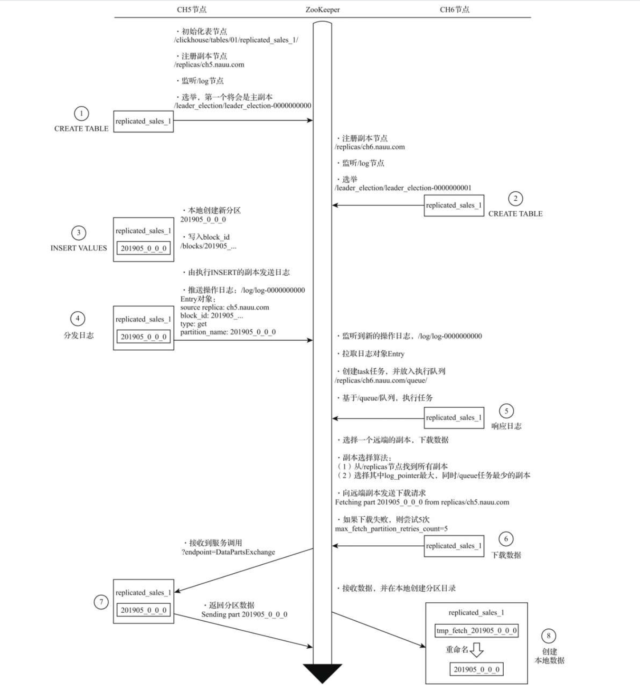

## 数据副本
ReplicatedMergeTree是MergeTree的派生引擎，它在MergeTree的基础上加入了分布式协同的能力。

依赖ZooKeeper：在执行INSERT和ALTER查询的时候，ReplicatedMergeTree需要借助ZooKeeper的分布式协同能力，以实现多个副本之间的同步。但是在查询副本的时候，并不需要使用ZooKeeper。

## 定义形式
```
ENGINE = ReplicatedMergeTree(
    'zk_path',
    'replica_name'
)
```
* zk_path：zk_path用于指定在ZooKeeper中创建的数据表的路径，路径名称是自定义的，并没有固定规则，用户可以设置成自己希望的任何路径。即便如此，ClickHouse还是提供了一些约定俗成的配置模板以供参考，/clickhouse/tables/{shard}/table_name
* replica_name：作用是定义在ZooKeeper中创建的副本名称，该名称是区分不同副本实例的唯一标识。一种约定成俗的命名方式是使用所在服务器的域名称。

## INSERT的核心执行流程



## 注意事项
/etc/hosts：一定要将集群中机器的主机名配置正确，因为zookeeper返回的是主机名，配置错误或不配置复制表时会失败.
