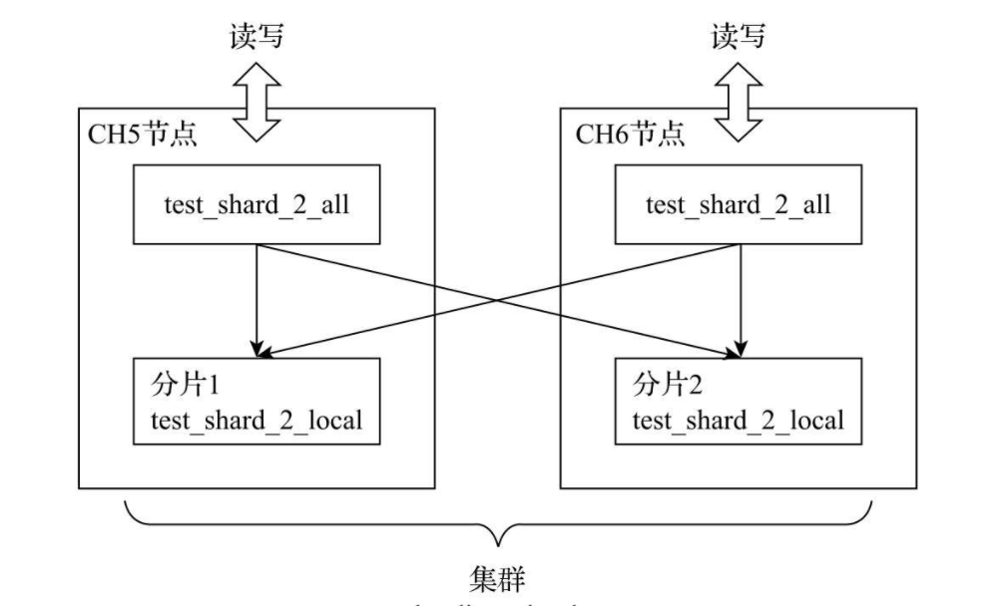
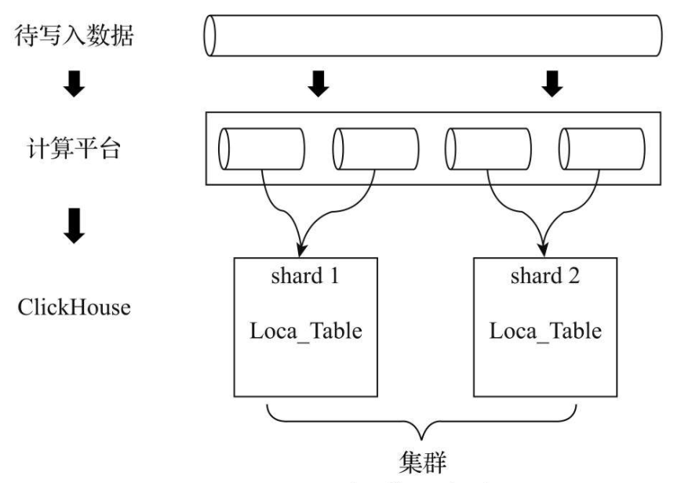
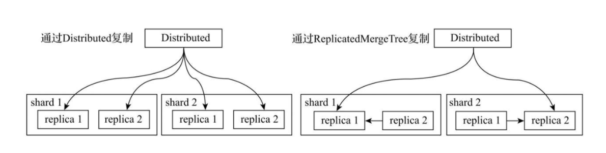

## 分布式表
分布式表只是作为一个查询引擎，本身不存储任何数据，查询时将sql发送到所有集群分片，然后进行进行处理和聚合后将结果返回给客户端

## 集群配置
```xml
<yandex>
    <clickhouse_remote_servers>
        <tm_cluster_two_shards>
            <shard>
                <replica>
                    <host>ck1.example.com</host>
                    <port>9000</port>
                </replica>
            </shard>
            <shard>
                <replica>
                    <host>ck2.example.com</host>
                    <port>9000</port>
                </replica>
            </shard>
        </tm_cluster_two_shards>
    </clickhouse_remote_servers>
</yandex>
```

## 定义形式
```
ENGINE = Distributed(cluster, database, table[, sharding_key])
```
* cluster：集群名称，与集群配置中的自定义名称相对应。在对分布式表执行写入和查询的过程中，它会使用集群的配置信息来找到相应的host节点。
* database和table：分别对应数据库和表的名称，分布式表使用这组配置映射到本地表。
* sharding_key：分片键，选填参数。在数据写入的过程中，分布式表会依据分片键的规则，将数据分布到各个host节点的本地表。

在集群的每个分片节点上，都会创建一张Distributed表，如此一来便可以从其中任意一端发起对所有分片的读、写请求。如下图：



## 写入方式
* 一种是借助外部计算系统，事先将数据均匀分片，再借由计算系统直接将数据写入ClickHouse集群的各个本地表
* 通过Distributed表引擎代理写入分片数据的



## 数据副本
数据在多个副本之间，有两种复制实现方式：
* 一种是继续借助Distributed表引擎，由它将数据写入副本；
* 另一种则是借助ReplicatedMergeTree表引擎实现副本数据的分发


